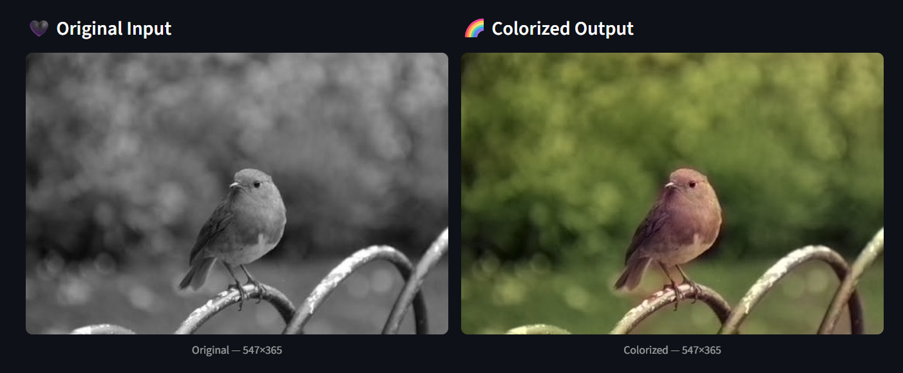
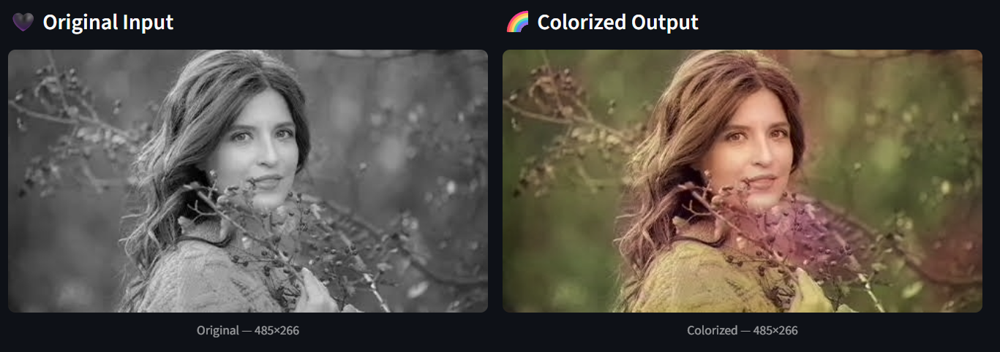
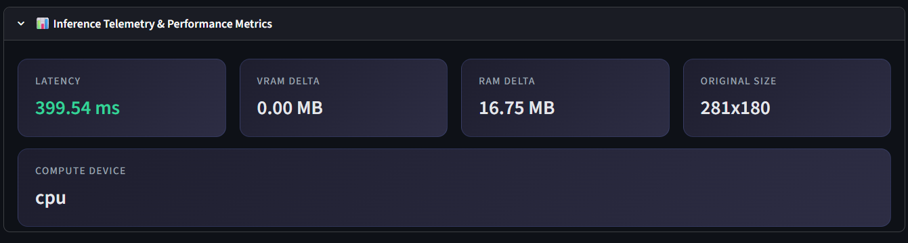

# 🎨 ChromaSynth: Neural Image Colorization Engine

[](https://pytorch.org/)
[](https://fastapi.tiangolo.com/)
[](https://streamlit.io/)
[](https://developer.nvidia.com/cuda-zone)
[](https://chromasynth-image-colorizer.streamlit.app/)

**🌐 Try the Live Demo here: [chromasynth-image-colorizer.streamlit.app](https://chromasynth-image-colorizer.streamlit.app/)**

A production-grade, modular **Model-as-a-Service (MaaS)** pipeline that colorizes grayscale images using a deep convolutional encoder-decoder neural network (ECCV 2016 model by Richard Zhang et al.). The system features a modular FastAPI inference backend optimized for NVIDIA CUDA GPUs and an interactive Streamlit dashboard displaying live SDE telemetry (VRAM/RAM footprint deltas, processing latency) and DSML pipeline analysis.

---

## 📸 Interactive Showcase & Results

Below are actual results from the engine showing the side-by-side reconstruction of chrominance channels:

### 🍎 Grayscale to Color Reconstruction



### 📊 Real-Time SDE Telemetry Panel


---

## 📂 Repository Structure

```
├── colorizer/               # Core neural network modules
│   ├── __init__.py          # Exposes clean factory interfaces & helpers
│   ├── base_color.py        # Abstract BaseColor class defining Lab normalization constants
│   ├── eccv16.py            # PyTorch implementation of the 8-block ECCV 2016 CNN architecture
│   └── util.py              # Image utilities handling color transformations and bilinear scaling
├── main.py                  # FastAPI Model-as-a-Service wrapper with lifespan GPU cache pinning
├── metrics.py               # Custom context-manager profiler (VRAM/RAM) and DSML indicators (PSNR/SSIM)
├── app.py                   # State-persistent Streamlit client with interactive dashboards
├── requirements.txt         # Pinned packages for deployment compatibility
└── README.md                # Presentation documentation
```

---

## 🔬 Deep Learning Architecture & Pipeline

Unlike simple networks that try to regress directly to red, green, and blue ($RGB$) pixel intensities, this engine frames colorization as a **multinomial classification task within the CIELAB ($Lab$) color space**.

### 1. The CIELAB ($Lab$) Color Space Advantage
*   **$L$ (Lightness)**: Holds all structural, edge, and texture details (1 channel).
*   **$a$ and $b$ (Chrominance)**: Represents green-red and blue-yellow color components respectively (2 channels).
*   **Why $Lab$ over $RGB$?** 
    Direct $RGB$ regression ($L_2$ loss) forces the model to choose the "average" color when uncertain. For instance, if an apple could be red or green, the $L_2$ minimum average is a muddy brown. By isolating structural details in $L$ and predicting $ab$ separately, the network focuses entirely on semantic color classification.

### 2. Network Topology (ECCV 2016)
The architecture is an **8-block fully-convolutional encoder-decoder** designed to capture rich spatial context:

*   **Feature Downsampling (Blocks 1–3)**: Uses strided $3\times3$ convolutions to downsample the spatial dimensions (reducing size from $256\times256$ to $32\times32$) while expanding channel depth from $1$ to $256$.
*   **Dilated Convolutions (Blocks 4–7)**: Rather than continuing to downsample (which would destroy spatial location details), the model uses dilated convolutions (dilation rate = 2) at a channel depth of $512$. This expands the receptive field of the kernels exponentially without loss of spatial resolution.
*   **Decoded Classification Head (Block 8)**: Uses a transposed convolution to upscale features back to $128\times128$. It outputs a distribution over **313 quantized $ab$ color bins**.
*   **Regression via Expectation**: To convert the classification probabilities back to continuous $ab$ values, we apply a softmax over the 313 bins and compute the expectation, followed by a final $4\times$ bilinear upsampling to map back to the original image dimensions.

### 3. Detailed Data Flow
```
[ Input Grayscale (RGB or 1-ch) ]
               │
               ▼
   [ Extract L Channel (0-100) ] ──────────────┐ (Keep original size H x W)
               │                               │
               ▼ (Resize to 256x256)           │
   [ Input Tensor [1, 1, 256, 256] ]           │
               │                               │
               ▼ (Normalize to [-0.5, 0.5])    │
      ===================================      │
        NVIDIA CUDA GPU INFERENCE PASS         │
      ===================================      │
               │                               │
               ▼                               │
   [ Predicted ab Tensor [1, 2, 64, 64] ]      │
               │                               │
               ▼ (Bilinear Upsample to H x W)  │
   [ Upsampled ab [1, 2, H, W] ]               │
               │                               │
               ▼                               ▼
     [ Concatenate L + ab ➔ Lab [1, 3, H, W] ]
               │
               ▼
     [ Convert Lab ➔ RGB ]
               │
               ▼
   [ Compressed JPEG Byte Stream ]
```

---

## 🛠️ Software Architecture (MaaS)

*   **Global Lifecycle Management**: Using FastAPI's modern `lifespan` handler, the 32-million parameter generator network and its weights are loaded into GPU memory (`.to('cuda')`) **exactly once** on startup.
*   **No-Gradient Inference**: Gradients are globally disabled (`torch.set_grad_enabled(False)`) and the model is locked in `.eval()` mode, preventing memory leaks or execution graph compilation overhead.
*   **Custom SDE Telemetry**: High-precision timers (`time.perf_counter()`), process resource tracking (`psutil`), and CUDA memory hooks (`torch.cuda.memory_allocated()`) log latency and memory deltas for every request, returned inside custom HTTP headers:
    *   `x-inference-latency-ms`
    *   `x-vram-delta-mb`
    *   `x-ram-delta-mb`

---

## ⚙️ Environment Setup & CUDA GPU Guide

### 1. Setup Virtual Environment
```bash
python -m venv venv
```
Activate the environment:
*   **Windows (PowerShell)**: `.\venv\Scripts\Activate.ps1`
*   **Linux / macOS**: `source venv/bin/activate`

### 2. Install PyTorch with CUDA Support
Ensure your system uses GPU acceleration by installing PyTorch matching your NVIDIA CUDA version:

*   **For CUDA 12.1 (Recommended)**:
    ```bash
    pip install torch torchvision --index-url https://download.pytorch.org/whl/cu121
    ```
*   **For CUDA 11.8**:
    ```bash
    pip install torch torchvision --index-url https://download.pytorch.org/whl/cu118
    ```
*   **CPU Fallback**:
    ```bash
    pip install torch torchvision
    ```

### 3. Install Requirements
```bash
pip install -r requirements.txt
```

---

## 🚀 Running the Stack

Activate your environment and run the services in separate terminals:

1. **Start the FastAPI Backend** (Runs on port `4500`):
   ```bash
   python main.py
   ```
2. **Start the Streamlit Web Application** (Runs on port `8501`):
   ```bash
   streamlit run app.py --server.port 8501
   ```
   *Navigate to `http://localhost:8501` to test the colorization dashboard!*
